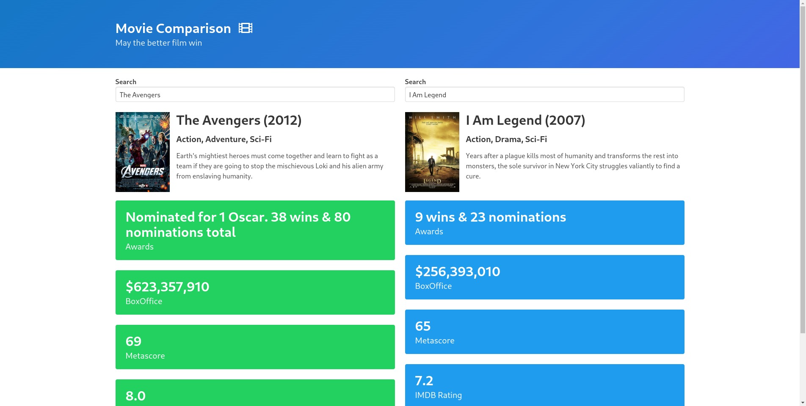

# Movie comparison application

- Compare two movies chosen by you in multiple aspects like imdb rating, metascore, box office, awards etc...

- [Try it out!](https://cryptic-deer.github.io/compare-movies/)

## Description

- The app uses the [omdbAPI](http://www.omdbapi.com/) API to fetch the movie information
- It has an autocomplete function on the dropdown menu
- I used Bulma to quickly style the elements, the design wasn't a main point in this project
- I tried out Mocha for testing, but I read that it isn't too great for testing in the browser
